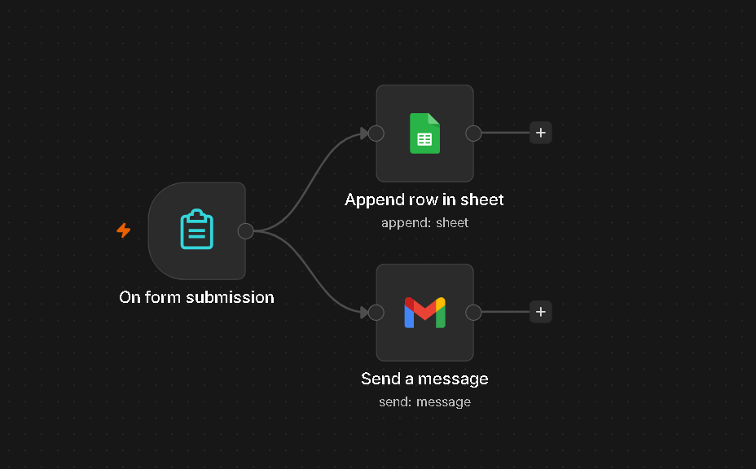
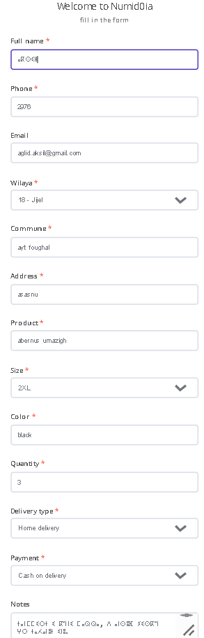
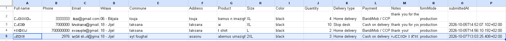
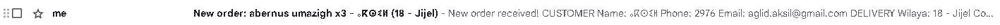
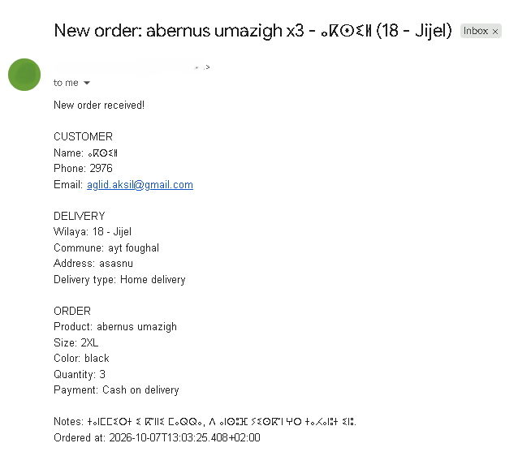
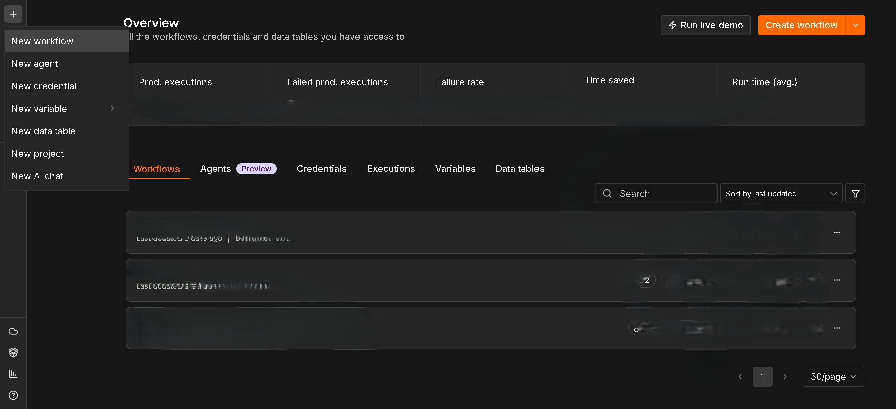
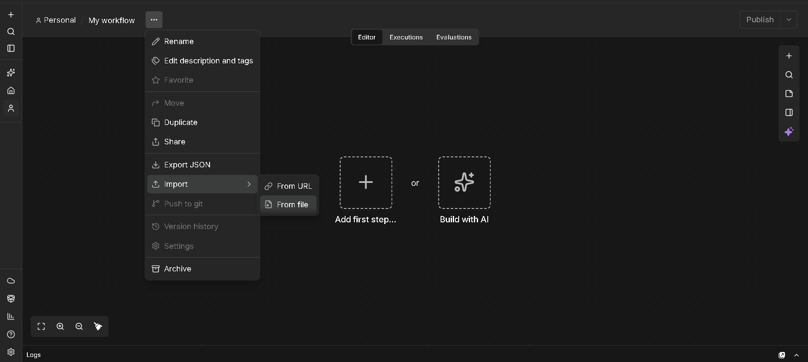
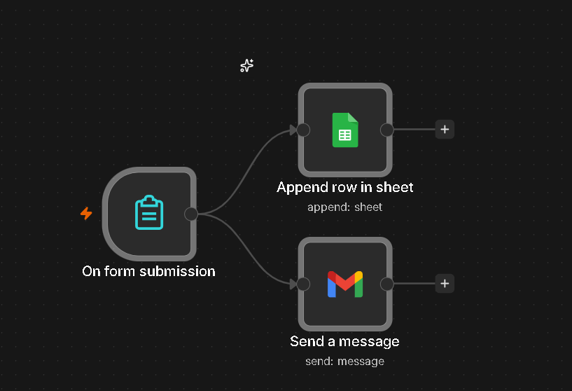

# Order Automation for Clothing Store — n8n Workflow

## Problem

Small clothing businesses process orders manually:
- Customer fills out a form
- Owner copies data into a spreadsheet
- Owner manually sends confirmation email

This is slow, error-prone, and doesn't scale.

## Solution

End-to-end automation using n8n:

1. Customer fills out an order form
2. Data is automatically appended to a Google Sheet
3. Business owner receives an instant email notification

## Tech Stack

| Tool | Purpose |
|------|---------|
| n8n | Workflow automation |
| Google Sheets API | Data storage |
| Gmail | Email notification |

## Screenshots

### Workflow Topology

### Order Form

### Google Sheet Output

### Email Notification

## Skills Demonstrated

- Event-driven automation
- API integration
- Data pipeline design
- No-code/low-code workflow building

## Cybersecurity Relevance

This workflow mirrors what happens in a SOC:

| This Project | SOC Equivalent |
|--------------|----------------|
| Form submission | SIEM alert |
| Append to Google Sheet | Log to database |
| Send email | Notify analyst |
| n8n workflow | SOAR playbook |

#### Files

| File | Purpose |
|---|---|
| `workflow.json` | Sanitized n8n export. Import this to run the workflow. |
| `screenshots/` | Visual proof of the workflow in action. |

### How to Export a Workflow from n8n

1. Open the workflow in your n8n instance.
2. Click the **three-dot menu (⋯)** in the top-right of the workflow editor.
3. Select **Export JSON**.
4. The file downloads as `<workflow-name>.json`.

### How to Import a Workflow into n8n

1. Open your n8n instance.
2. Click the **three-dot menu (⋯)** next to your workflow list, or in the editor.
3. Select **Import** → **From File**.
4. Choose the `workflow.json` file.
5. The workflow opens in the editor. Credential warnings appear on the Gmail and Google Sheets nodes — this is expected.
6. Click each node with a warning and configure your own credentials.
7. Replace the placeholders (`YOUR-WEBHOOK-ID`, `YOUR-SHEET-ID`, `your-email@example.com`) with your own values.
8. Save and activate the workflow.

### Screenshots

**n8n Dashboard**

**Export and Import Menu**

**Workflow Topology**

## Connect

- **LinkedIn:** [linkedin.com/in/adel-boutaghane](https://www.linkedin.com/in/adel-boutaghane-54b982386)
- **GitHub:** [github.com/agurzil-kutama](https://github.com/agurzil-kutama)
